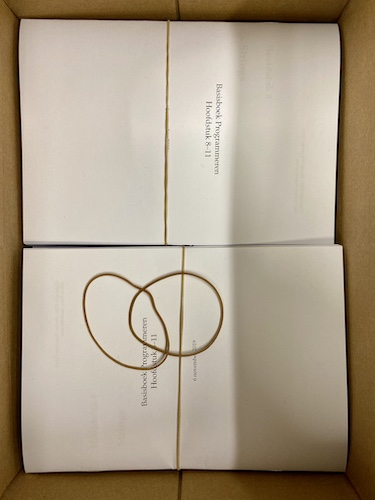

# Programming basics

{: style="float: right; max-width: 10em;"}

To allow students practice with core programming concepts, we developed a practice book that may be used alongside introductory programming courses. Our current insight is that students appreciate this form of deliberate practice, and that it allows us teachers to better find students who struggle with the course materials. This is especially fostered by the system of regular check-ups in the form of mini-tests which encourage (and require) students to show mastery of the materials.

## Book

The first version of the book, in Dutch, is now available on GitHub. It will be partially translated over the next few days.

- Downloads
    - [Current version of the book (Dutch)](book.pdf)
- Sources
    - [GitHub: Programming Basics organization](https://github.com/prgbas)
    - [Programming Basics book TeX sources](https://github.com/prgbas/book) (Creative Commons)

## Forthcoming

Potentially forthcoming are:

- Sample tests that we do not use anymore
- Our Flask-based system to book test appointments
- Software for validation

Let me know if you're interested to work with us on these and other tools!

## Poster: A set of exercises and tests for teaching tracing skills using a mastery approach

Presented at Koli Calling 2019. Proceedings (TBA). [Pre-print](stegeman-basics-2019.pdf).

> "We present a first implementation of exercises on code evaluation and tracing for use alongside introductory programming courses. The goal of these exercises and accompanying tests is to provide a structure that enables students to fully master a number of common tracing skills. In developing the exercises, we focused on keeping cognitive load as low as possible by gradually introducing new programming language elements, while allowing for repeated practice of previously introduced concepts. The exercises range from evaluating expressions involving integer division to tracing loops with multiple variables. We also generated small tests that students take to show their mastery of the concepts, allowing only a very limited number of mistakes per test and requiring students to take another version if needed. Using this model in several introductory programming courses over the past year shows that it appears to be possible to achieve mastery on these tracing skills for almost all students while maintaining positive attitudes toward the exhaustive training process."
